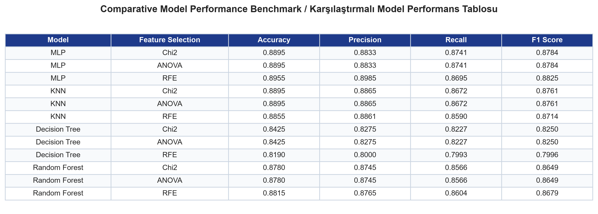
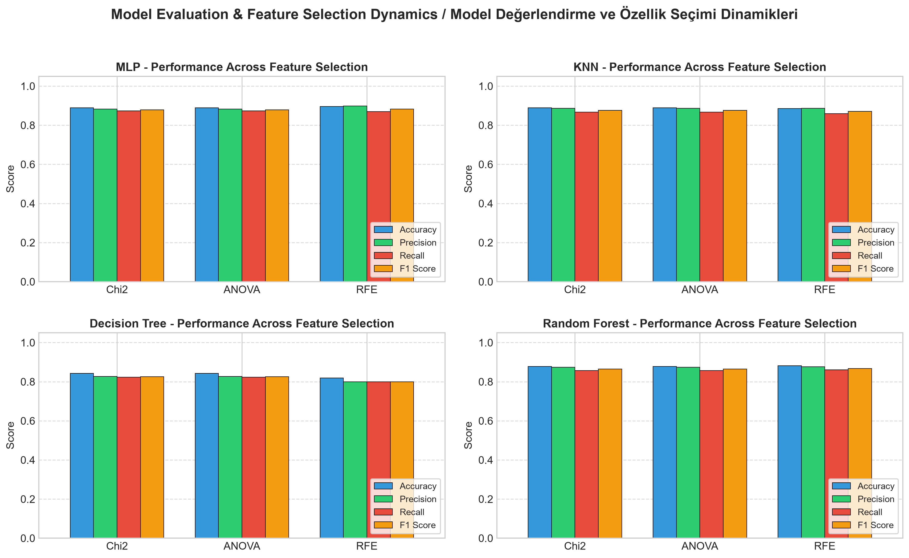
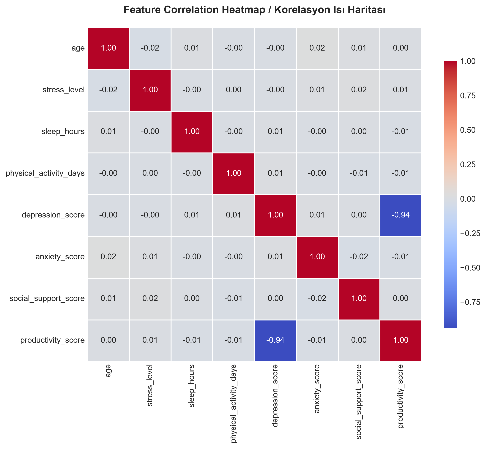
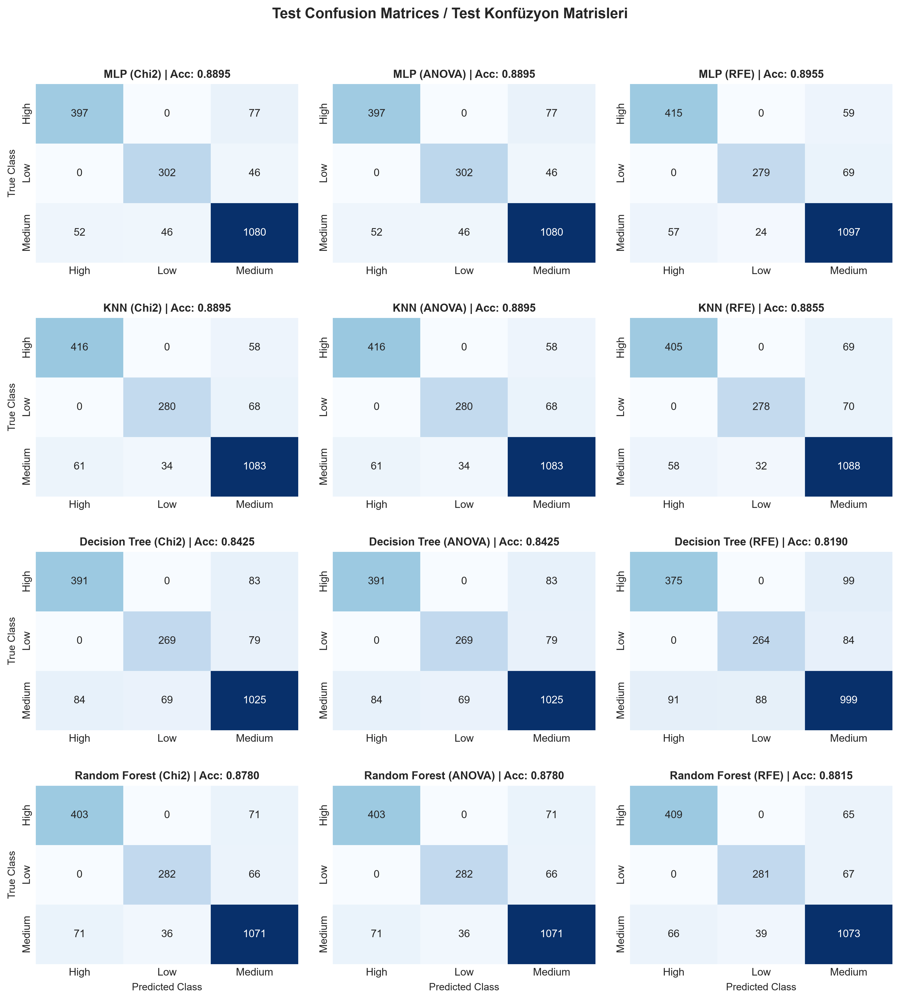

<div align="center">

[English](#english) | [Türkçe](#türkçe)

</div>

---

<a name="english"></a>
# Mental Health Risk Prediction System

Mental Health Risk Prediction is an end-to-end machine learning framework designed to assess and predict individual mental health risk levels using tabular behavioral, occupational, psychological, and lifestyle indicators.

By analyzing multi-dimensional factors—such as stress levels, sleep duration, physical activity, anxiety scores, social support, work environments, and treatment-seeking behaviors—the system applies multi-strategy feature selection (Chi-Square, ANOVA, RFE) across four machine learning architectures (MLP, Random Forest, KNN, Decision Tree) and serves the top-performing model via an interactive Streamlit web dashboard.

---

## Data Pipeline & Preprocessing Methodology

The data pipeline standardizes and prepares raw behavioral survey logs for tabular machine learning models:

1. **Ingestion & Outlier Analysis:** Dynamic ingestion of raw tabular records (10,000 samples) paired with Z-score outlier detection ($|Z| > 3.0$) across continuous numerical dimensions.
2. **Target Leakage Prevention:** Elimination of post-hoc diagnostic features (e.g., `depression_score`) to prevent target leakage and ensure clinical validity during prospective inference.
3. **Categorical Encoding:** Categorical entities (`gender`, `employment_status`, `work_environment`, `mental_health_history`, `seeks_treatment`) are converted into numerical codes using `LabelEncoder`.
4. **Feature Normalization & Stratification:**
   - Continuous numerical features are scaled to $[0, 1]$ interval using `MinMaxScaler`.
   - Stratified dataset partitioning by target distribution ensures consistent class balance:
     - **Training Set (80% / 8,000 samples)**
     - **Test Benchmark Set (20% / 2,000 samples)**

---

## Feature Selection & Model Architectures

### 1. Feature Selection Strategies
To optimize model interpretability and minimize feature redundancy, three distinct feature selection techniques are benchmarked (selecting top $k=4$ features):

- **Chi-Square ($\chi^2$):** Measures statistical dependency with the target class.
- **ANOVA F-Test:** Evaluates feature variance ratios across target classes.
- **RFE:** Iteratively prunes features using decision tree importance weights.

### 2. Machine Learning Classifiers
Four distinct machine learning architectures are evaluated across all feature selection subsets (12 total benchmark combinations):

- **MLP (ANN):** 2-hidden-layer $(50, 50)$ neural network with ReLU and Adam.
- **Random Forest:** Ensemble of 300 bagged trees with bootstrap feature splits.
- **KNN:** Distance-based learning using 15 neighbors with uniform weights.
- **Decision Tree:** CART-based recursive partitioning decision tree classifier.

---

## Model Performance & Evaluation

All models are systematically benchmarked on test data across **Accuracy**, **Precision**, **Recall**, and **F1 Score**.

### 1. Comparative Evaluation Metrics
Comprehensive performance breakdown across all 12 model and feature selection combinations:



### 2. Performance Comparison Across Feature Selection
Multi-metric breakdown highlighting Accuracy, Precision, Recall, and F1 Score for each model:



### 3. Feature Correlation Heatmap
Inter-feature linear correlations across numerical survey parameters:



### 4. Test Confusion Matrices
Visualizing true positive rates and classification error distributions across risk tiers (**High**, **Low**, **Medium**):



---

## Project Structure

```
Mental-Health-Risk-Prediction/
├── data/                                 # Central data storage
│   ├── raw/                              # Raw survey dataset
│   │   └── mental_health_dataset.csv
│   └── processed/                        # Cleaned & encoded dataset
│       └── mental_health_data_processed.csv
├── core/                                 # Core machine learning & processing modules
│   ├── preprocessing.py                  # Ingestion, cleaning, encoding & preprocessing pipeline
│   └── train.py                          # Multi-model training, feature selection & evaluation orchestrator
├── web/                                  # Presentation layer
│   └── app.py                            # Streamlit interactive web dashboard
├── models/                               # Serialized model artifacts
│   └── best_model.pkl                    # Top-performing model artifact & metadata
├── results/                              # Generated high-resolution analytical figures
│   ├── correlation_matrix.png            # Feature correlation heatmap
│   ├── model_evaluation_metrics.png      # Formatted metric comparison table
│   ├── performance_comparison.png        # Bar charts comparing feature selection strategies
│   └── confusion_matrices.png            # 4x3 confusion matrix grid
├── requirements.txt                      # Project dependencies
├── .gitignore                            # Git ignore rules
└── README.md                             # Documentation
```

---

## Installation & Usage

### 1. Environment Setup
Clone the repository and install required dependencies:
```bash
git clone https://github.com/furkan-ylmz/Mental-Health-Risk-Prediction.git
cd Mental-Health-Risk-Prediction
pip install -r requirements.txt
```

### 2. Data Preprocessing
Run the preprocessing pipeline to clean data and encode categorical features:
```bash
python core/preprocessing.py
```

### 3. Model Training & Evaluation
Train all 4 models across 3 feature selection strategies, generate visual artifacts, and save the top-performing model:
```bash
python core/train.py
```

### 4. Interactive Web Application
Launch the Streamlit web prediction interface:
```bash
streamlit run web/app.py
```

<br>

---

<a name="türkçe"></a>
# Mental Sağlık Riski Tahmin Sistemi

Mental Sağlık Riski Tahmini, bireylerin yaşam tarzı, çalışma ortamı, biyometrik göstergeleri ve psikolojik metriklerini kullanarak mental sağlık risk düzeylerini tahmin eden uçtan uca bir makine öğrenmesi sistemidir.

Stres seviyesi, uyku süresi, fiziksel aktivite, anksiyete skoru, sosyal destek, çalışma düzeni ve tedavi arayışı gibi çok boyutlu parametreleri analiz eden sistem; 3 farklı özellik seçimi yöntemini (Chi-Square, ANOVA, RFE) 4 farklı makine öğrenmesi algoritması (MLP, Random Forest, KNN, Decision Tree) üzerinde test eder ve en başarılı modeli etkileşimli bir Streamlit web paneli üzerinden sunar.

---

## Veri Hattı ve Ön İşleme Metodolojisi

Veri hattı, ham anket ve davranış verilerini makine öğrenmesi modellerine uygun hale getirmek için şu adımları uygular:

1. **Veri Toplama ve Aykırı Değer Tespiti:** 10.000 satırlık ham veri seti okunur ve sayısal sütunlar üzerinde Z-skoru analizi ($|Z| > 3.0$) ile aykırı değer kontrolü gerçekleştirilir.
2. **Bilgi Sızıntısının (Data Leakage) Önlenmesi:** Hedef değişkenle yapay korelasyon oluşturabilecek tanısal değişkenler (`depression_score`) modelleme öncesinde veri setinden çıkarılır.
3. **Kategorik Kodlama (Label Encoding):** Kategorik değişkenler (`gender`, `employment_status`, `work_environment`, `mental_health_history`, `seeks_treatment`) `LabelEncoder` ile sayısallaştırılır.
4. **Özellik Normalizasyonu ve Katmanlı Bölme:**
   - Sayısal değişkenler `MinMaxScaler` kullanılarak $[0, 1]$ aralığına normalize edilir.
   - Sınıf dağılımını korumak için katmanlı bölme (Stratified Split) uygulanır:
     - **Eğitim Seti (%80 / 8.000 örnek)**
     - **Test Seti (%20 / 2.000 örnek)**

---

## Özellik Seçimi ve Makine Öğrenmesi Mimarileri

### 1. Özellik Seçimi Yöntemleri
Model karmaşıklığını azaltmak ve en etkili öznitelikleri belirlemek amacıyla 3 farklı yöntemle en iyi $k=4$ özellik seçilmiştir:

- **Chi-Square ($\chi^2$):** Özellikler ile hedef sınıf arasındaki bağımlılığı ölçer.
- **ANOVA F-Testi:** Sayısal özelliklerin risk sınıflarına göre varyansını analiz eder.
- **RFE:** Karar ağacı önem ağırlıklarına göre özellikleri yinelemeli olarak eler.

### 2. Kullanılan Makine Öğrenmesi Modelleri
Seçilen özellik kümeleri üzerinde 4 farklı makine öğrenmesi mimarisi eğitilerek toplam 12 farklı konfigürasyon kıyaslanmaktadır:

- **MLP (YSA):** ReLU ve Adam optimizasyonlu $(50, 50)$ iki gizli katmanlı YSA.
- **Random Forest:** 300 karar ağacından oluşan bootstrap topluluk modeli.
- **KNN:** 15 komşuluk parametreli uzaklık tabanlı sınıflandırıcı.
- **Decision Tree:** CART algoritmasına dayalı karar ağacı sınıflandırıcısı.

---

## Model Performans Analizi ve Sonuçlar

Tüm modeller test verisi üzerinde **Accuracy**, **Precision**, **Recall** ve **F1 Skoru** metrikleriyle değerlendirilmiştir.

### 1. Karşılaştırmalı Model Değerlendirme Tablosu
12 farklı model ve özellik seçimi kombinasyonunun test sonuçları:


### 2. Özellik Seçimi ve Model Başarım Grafikleri
Tüm modeller için Accuracy, Precision, Recall ve F1 skorlarının karşılaştırmalı sütun grafiği:


### 3. Özellik Korelasyon Matrisi
Sayısal parametreler arasındaki doğrusal ilişkileri gösteren korelasyon ısı haritası:


### 4. Test Seti Konfüzyon Matrisleri
Hedef sınıflar (**Yüksek**, **Düşük**, **Orta**) üzerindeki doğru sınıflandırma oranları ve hata dağılımları:


---

## Proje Dizin Yapısı

```
Mental-Health-Risk-Prediction/
├── data/                                 # Merkezi veri dizini
│   ├── raw/                              # Ham veri seti
│   │   └── mental_health_dataset.csv
│   └── processed/                        # Temizlenmiş ve kodlanmış veri seti
│       └── mental_health_data_processed.csv
├── core/                                 # Çekirdek makine öğrenmesi modülleri
│   ├── preprocessing.py                  # Veri temizleme, kodlama ve ön işleme hattı
│   └── train.py                          # Model eğitimi, özellik seçimi ve değerlendirme yöneticisi
├── web/                                  # Web sunum katmanı
│   └── app.py                            # Streamlit interaktif web tahmin paneli
├── models/                               # Kaydedilen model dosyaları
│   └── best_model.pkl                    # En yüksek başarıma sahip model ve metadata
├── results/                              # Üretilen grafik ve görsel analiz çıktıları
│   ├── correlation_matrix.png            # Korelasyon ısı haritası
│   ├── model_evaluation_metrics.png      # Formatlı metrik karşılaştırma tablosu
│   ├── performance_comparison.png        # Özellik seçimi performans sütun grafikleri
│   └── confusion_matrices.png            # 4x3 konfüzyon matrisi ızgarası
├── requirements.txt                      # Python bağımlılık listesi
├── .gitignore                            # Git yoksayma kuralları
└── README.md                             # Kapsamlı dokümantasyon
```

---

## Kurulum ve Çalıştırma

### 1. Bağımlılıkların Yüklenmesi
Repoyu klonlayın ve gerekli Python paketlerini yükleyin:
```bash
git clone https://github.com/furkan-ylmz/Mental-Health-Risk-Prediction.git
cd Mental-Health-Risk-Prediction
pip install -r requirements.txt
```

### 2. Veri Ön İşleme (Data Preprocessing)
Ham veriyi işleyip temizlenmiş veri setini oluşturun:
```bash
python core/preprocessing.py
```

### 3. Model Eğitimi ve Değerlendirme (Training)
Tüm modelleri ve özellik seçimi kombinasyonlarını eğitin, grafikleri üretin ve en iyi modeli kaydedin:
```bash
python core/train.py
```

### 4. Web Tahmin Uygulaması (Streamlit)
Etkileşimli web arayüzünü başlatın:
```bash
streamlit run web/app.py
```